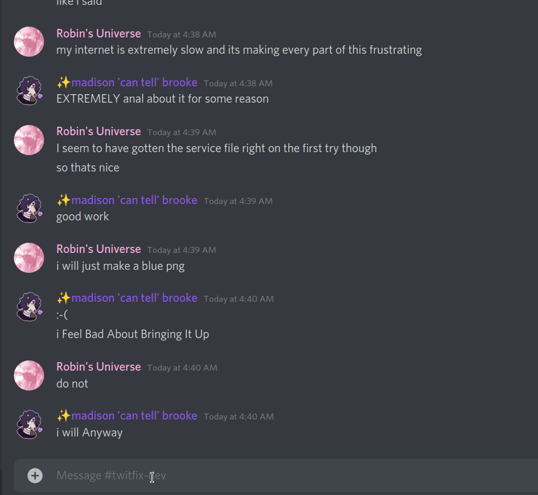

 

# TwitFix Bot

Share your videos faster

# !! THIS PROJECT IS DISCONTINUED !!

This bot was always a bit of a mess, and people have been joining it to servers despite it not having been running for several months at this point, so I just wanted to update the readme to reflect the fact that this bot is no longer in active development and is not being hosted anywhere. The original TwitFix project is still going strong, but this bot implementation has always been pretty bad, so I have decided to drop it in favor of other, better bots, here's a few that I found with just a quick search on github alone:

[fxtwitter-bot by RedDaedalus](https://github.com/RedDaedalus/fxtwitter-bot)

[fxtwitter-discord by Nsttt](https://github.com/Nsttt/fxtwitter-discord)

[tweetFix by noogai15](https://github.com/noogai15/tweetFix)

[MediaFixer by Yber0](https://github.com/Yber0/MediaFixer)

[fxthis by brunocrocomo](https://github.com/brunocrocomo/fxthis)

There are probably more floating around, if anyone has any they'd like to submit to be added to this list, please leave an issue on the repo to alert me of this

# Original Readme

This is a small discord bot that scans messages for twitter links, and on finding one, it tries various methods to determine if its a video link, if it is, it kills the messages embed, and replies to it with a fxtwitter link, fixing the video embed

This project is licensed under the **WTFPL**

## Config

A Default config file will be generated when you first run the script. This needs to be filled out before the bot can run (mostly the token).

### **API**

- **token**: This is your discord bot token
- **api_key**, **api_secret**, **access_token**, **access_secret**: This is API info required to use the Twitter API if that is the method you choose

### **Config**

- **admin**: This is the discord user ID of the person you want access to the one admin command, reload
- **database**: Link to your mongoDB link cache database if you use this method for link caching
- **link_cache**: (db, json) This determines if you would like to use a local json file for the link cache, or use a mongoDB database
- **method**: (api, youtube-dl, hyrbid) This determines if you want to use the twitter API, youtube-dl, or to start off with the Twitter API and fall back on youtube-dl to determine if the link is a video or not

The rest of the options aren't really relevant yet.

**notes:**

This is built to work with the TwitFix link cache database, meaning that any video linked using that before, will not need to be rescanned.

